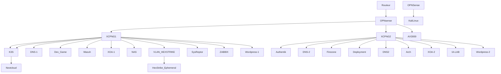
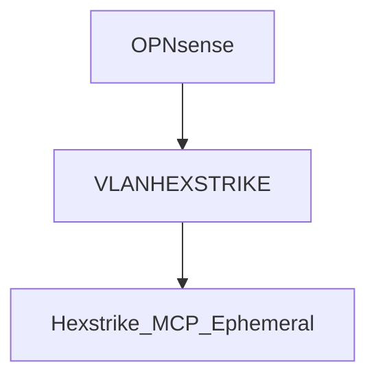
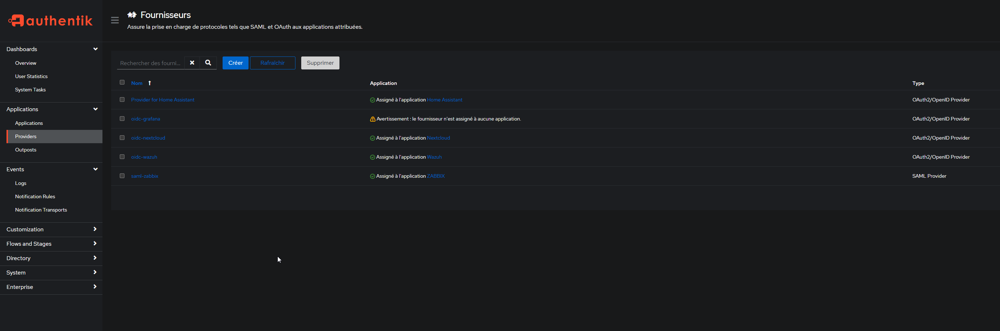
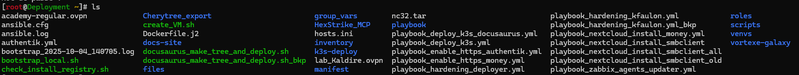
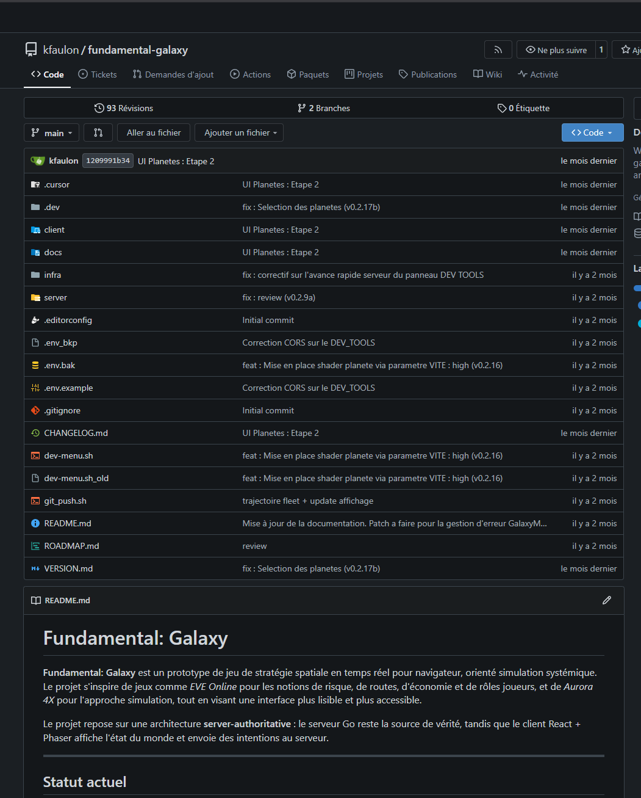
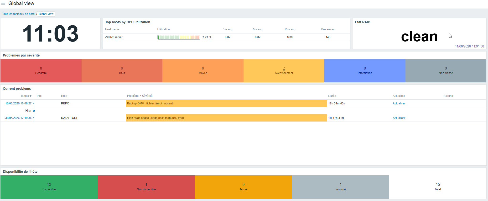

# Infrastructure Global

Apercu de l'infrastructure Homelab. Pour des raisons principal de couts, beaucoup de systèmes qui meriterais une HA ne l'ont pas (Ex : NAS)

Cette infrastructure est amené à changer selon les besoins (Bastion, DMZ, ...)

# Réseau

La VM ephémère HexStrike, serveur hebergeant un MCP de Pentest Offensif, étant une machine critique et par définition vulnérable (prompt injection pour n'en cité qu'une), est séquestré dans un VLAN par le biais du Firewall. Ainsi, par des règles sricts, la VM Hexstrike n'a qu'une portée extremement limité sur le réseau.

# Sécurité

Gestion des certificat HTTPS via autorité local OPNSense.
Authentification au Web locaux uniquement via HTTPS et principalement via Authentik (SSO, authentification Fingerprint et mobile), serveur IdP du réseau.

 

VM durcies par connexion autorisé via un seul utilisateur, filtrage via Firewall (pour les flux y passant) + regles iptables / firewalld, interdiction sudo, ...

# Deploiements

 

 Le déploiement de VM se fait soit :
 - En manuel, avec import de template VM dans l'Hyperviseur, puis lancement d'ansibles tel que le [bootstrap_local](docs/bootstrap_local.sh), qui installe un utilisateur wheel, ainsi que sa clé SSH, puis des playbook hardenings d'utilisateurs et de configurations specifique.
 - En déploiement automatisé via Terraform, piloté par un [.sh](docs/bootstrap_hexstrike.sh) pour l'installation / destruction d'une VM MCP_Hexstrike.

 Versionning avec Gitea
  

# Virtualisation

- Plusieurs docker tournent sur les machines, en particulier Gitea, Bloodhound (sur KaliLinux )
- Une VM Kubernetes K3S est utilisé a fin d'experimentation et pour la gestion de Nextcloud, Money, Semaphore UI, et prochainement un stack Prometheus + Grafana.

# Supervision

- Supervision des status et des alertes Hardware via Zabbix

- Developpement en cours de la supervision via Wazuh (SIEM)

